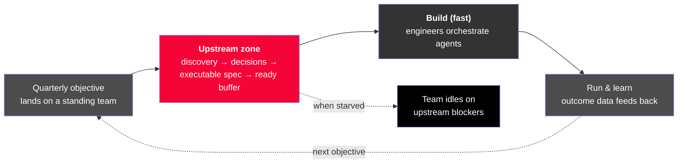
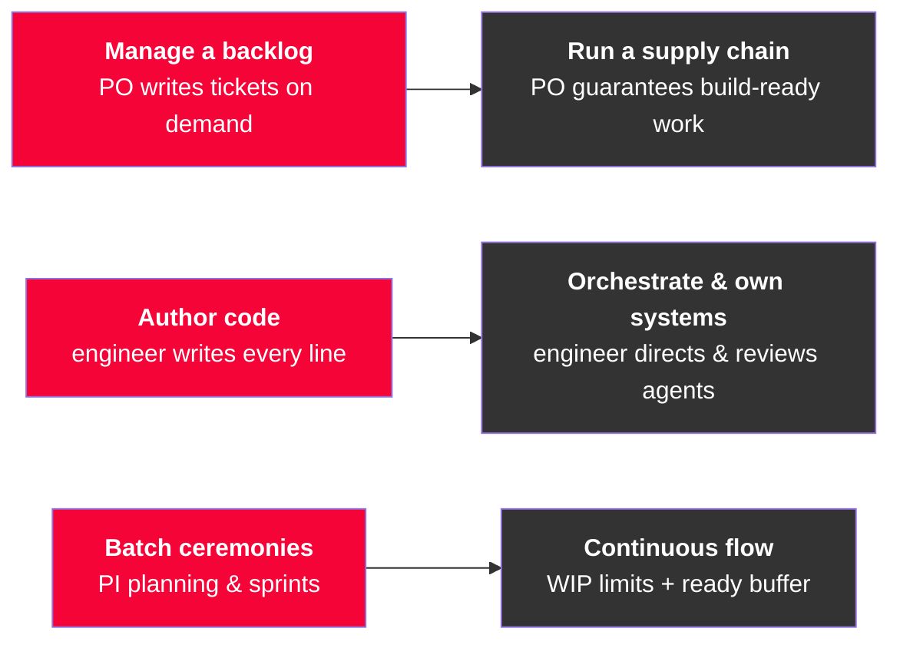
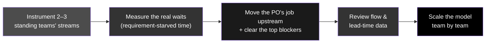

# Executive Summary — The One-Pager

> **Read it in two minutes. It answers the question leadership keeps asking: _"What is the new model we work in, now that agentic development is here and the ecosystem is built?"_**

---

## The situation

We have built the agentic ecosystem, and it works: teams can now design, build, and ship far faster than the old delivery process assumed. But build was only ever **~20–30% of end-to-end lead time**. Making it fast does not make value reach customers faster on its own — it **moves the constraint upstream**, to the requirements, decisions, and discovery that feed the team.

> The bottleneck is no longer writing the code. It is deciding _what_ to build, _clearly enough_, _fast enough_ to keep a fast team busy.

A faster, leaner team is now a given. The question is not whether we get smaller and more agentic — we do. The question is **what the operating model around that team has to become so the speed is real.**

---

## The new model in one picture

Teams are already **durable and topic-aligned**, fed new objectives each quarter. That part of the structure is right. What changes is that the **upstream zone becomes the job to manage** — because when build is fast and the team is lean, any gap upstream shows up immediately as idle capacity or wrong output.

---

## What actually changes

| Dimension | From | To |
|---|---|---|
| Where effort concentrates | Building the thing | Deciding and specifying the thing |
| The PO's job | Backlog custodian | Owner of the requirements supply chain |
| The engineer's job | Author of code | Orchestrator, reviewer, system-owner |
| The team's shape | Larger, build-heavy | Smaller, more senior, agent-augmented |
| The headline metric | Velocity / story points | Lead time & flow efficiency |
| Ceremonies | Big-batch PI planning & sprints | Continuous flow with WIP limits |

---

## Where the work actually gets stuck

A fast team is only as productive as the upstream supply feeding it. These are the real blockers — all on the **PO and requirements side**, not the build side:

- **Decision latency** — the team can build in hours but waits days for a decision.
- **Ambiguous, non-executable requirements** — specs a human _or an agent_ cannot act on without another meeting.
- **Unvalidated problems** — building the wrong thing fast is still waste.
- **Fragmented context** — the answer exists, but not where the team (or its agents) can reach it.
- **Cross-team dependencies & approvals** — someone else's queue becomes our idle time.
- **Objective churn & unclear priority** — priorities reshuffle faster than work completes.
- **The PO as a single point of contention** — every clarification routes through one overloaded person.

> The full catalogue — symptoms, why each bites harder now, and how to clear it — is in **[Upstream Blockers](upstream-blockers.md)**, the heart of this model.

---

## What to do about it

This is an operating-model change, not a reorganization and not primarily a budget exercise. Prove it where the constraint actually is:

The single most revealing number to bring back: **flow efficiency** — the share of lead time that is active work versus waiting. It is typically **15–25%**, meaning most of a team's time is spent blocked upstream. That is where the new model earns its keep.

---

## The one sentence to remember

> *"The ecosystem made building fast. The new model is about keeping a fast, lean team continuously fed with validated, build-ready work — so the constraint we have to manage now lives upstream, on the requirements side."*

---

*Full detail: [The Model at a Glance](model-at-a-glance.md) · [The Operating Model](future-delivery-operating-model.md) · [Upstream Blockers](upstream-blockers.md) · [Team Shape & Roles](team-shape-and-roles.md) · [Governance & Cadence](governance-and-cadence.md) · [Funding & Operating Budget](funding-and-operating-budget.md).*
