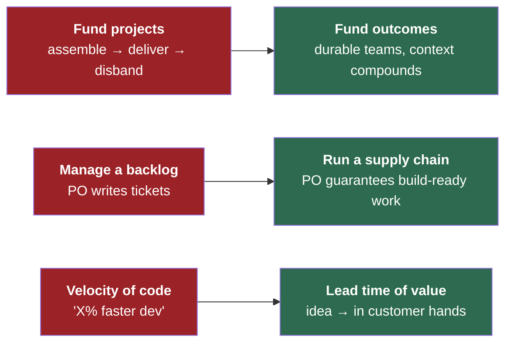
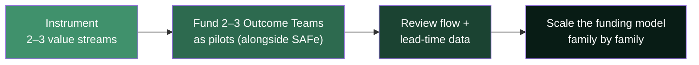

# Executive Summary — The One-Pager

> **The artifact to walk into the room with. Read it in two minutes; decide in ten.**

---

## The situation

AI has compressed software **build** time dramatically. But build was only **~20–30% of end-to-end lead time**. Speeding it up while leaving the surrounding process untouched does not make value reach customers faster — it **relocates the bottleneck upstream** to requirements, decisions, and discovery.

> We bought speed we cannot yet use, because the constraint moved to where we are not investing.

---

## The ask (in one line)

Do not fund "a new working model." **Rebalance the existing budget envelope** so the speed we already paid for actually reaches customers — and pilot it, don't reorganize.

---

## What changes

| Dimension | From | To |
|---|---|---|
| Unit of funding | A project with fixed scope | A durable team against outcomes |
| The PO's job | Backlog custodian | Owner of the requirements supply chain |
| The engineer's job | Author of code | Orchestrator, reviewer, system-owner |
| The headline metric | Velocity / story points | Lead time & flow efficiency |
| Ceremonies | Big-batch PI planning & sprints | Continuous flow with WIP limits |

---

## Why it pays

- **Flow efficiency is typically 15–25%** — meaning 75%+ of paid capacity spends its time *waiting*, mostly upstream. That is the money on the table.
- **Freed capacity is reallocated, not cut.** Cheaper build *increases* demand for it (Jevons paradox). The story is **growth and optionality**, not layoffs.
- **Context is the scarce asset.** Durable teams compound it; project teams re-pay the "learn the context" tax every time.

---

## What we want approved

A small, evidence-led pilot — **not** a reorganization. We bring back real flow-economics data on your own value streams before anything scales.

---

## The one sentence to remember

> *"You asked for a budget model. Here is the operating model that makes it make sense: move spend to where value is actually constrained, prove it on a pilot, then scale."*

---

*Full detail: [The Operating Model](future-delivery-operating-model.md) · [Team Shape & Roles](team-shape-and-roles.md) · [Funding & Operating Budget](funding-and-operating-budget.md) · [Governance & Cadence](governance-and-cadence.md) · [PO Spec Template](po-spec-template.md).*
