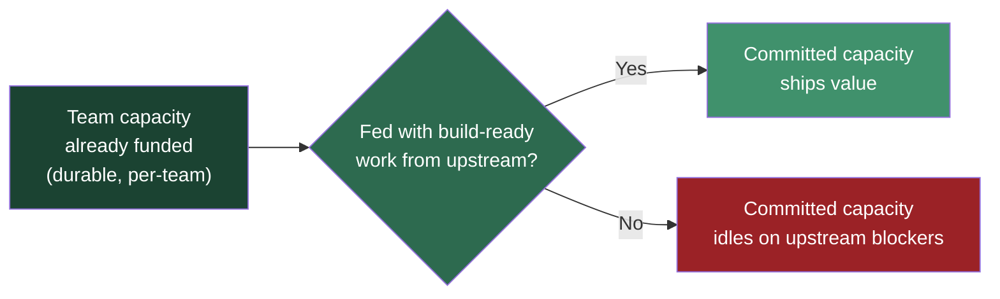
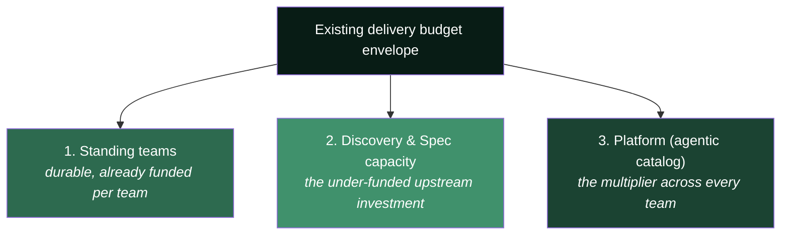
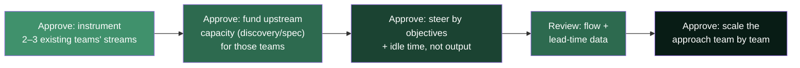

# Funding & Operating Budget

> **Budget is a consequence of the model, not the point of it. This page shows what the operating-model change means for how money is already spent — given that we already fund durable, topic-aligned teams.**

The question from leadership is not really *"what do we cut?"* — it is *"what is the new model we work in, now that build is fast and the ecosystem exists?"* Budget follows from that answer. This page translates the model into money terms **without** pretending we run a project-funding shop: we already fund standing teams. The real budget question is whether that already-committed capacity is **productive or idle**, and that is decided upstream.

---

## Table of Contents

- [The Central Argument](#the-central-argument)
- [We Already Fund Durable Teams — Fund What They Wait On](#we-already-fund-durable-teams-fund-what-they-wait-on)
- [Three Reframes for the Room](#three-reframes-for-the-room)
- [What Gets Funded](#what-gets-funded)
- [The Numbers to Bring](#the-numbers-to-bring)
- [What Leadership Actually Approves](#what-leadership-actually-approves)
- [Objection Handling](#objection-handling)

---

## The Central Argument

We compressed the build step. But build was ~20–30% of lead time, so speeding it up while keeping the surrounding process relocates the bottleneck upstream to requirements and decisions. The budget implication is not about restructuring how teams are funded — that is already sound — it is about what that funded capacity is spending its time on:

> We already pay for standing, topic-aligned teams. The question is not *"how much do we cut?"* It is *"is the capacity we already pay for actually shipping value, or is it idling on [upstream blockers](upstream-blockers.md) the PO and requirements side own?"*

Every hour a fast team waits on a decision, an ambiguous spec, or missing context is capacity **already paid for and wasted**. That is the money on the table — not headcount.

---

## We Already Fund Durable Teams — Fund What They Wait On

We do not assemble and disband project teams. Teams are **durable and topic-aligned**, funded separately from the topics they carry, and receive **new objectives each quarter**. That structure is already close to "outcome funding" — so the model does **not** ask leadership to change how teams are funded. It asks a sharper question:

> Given that team capacity is already committed, what determines whether that capacity produces value — and are we funding *that*?

The answer is the upstream zone. A standing team's throughput is capped not by its build speed but by whether it is continuously fed validated, build-ready work.

**The shift in one table:**

| Dimension | Where the attention was | Where it needs to be |
| --- | --- | --- |
| Unit of funding | Team capacity (already durable) | *Unchanged* — keep funding standing teams |
| What we optimize | Build throughput / output | Whether committed capacity is ever starved |
| Success measure | Features delivered | Objectives moved per quarter + near-zero idle time |
| Where the spend gap is | "Do we have enough engineers?" | "Do we fund enough discovery, spec, and context upstream?" |
| The waste to remove | Assumed to be headcount | Paid capacity idling on upstream blockers |
| Leadership's lever | Cut / add developers | Fund the upstream flow that keeps teams productive |

The reframe: the expensive problem is not team structure and not engineering headcount — it is **paid-for teams waiting on work that never arrives build-ready.**

---

## Three Reframes for the Room

**1. From cost-cutting to capacity reallocation.**
Framing AI savings as headcount reduction caps the upside at _cost savings_. Reframe as **capacity liberated for higher-value work** — more products updated more often, faster time-to-market, and the backlog of long-deferred modernization finally addressed. McKinsey's guidance is explicit: plan for skill shifts, apply freed talent to new business expansion. The story becomes **growth and optionality**, not savings.

**2. From velocity-of-code to lead-time-of-value.**
Today you can prove "X% faster development." A CFO discounts that if it doesn't hit the P&L. Change the headline to **end-to-end lead time (idea → in customer hands)** and **flow efficiency** (% of lead time that is active work vs. waiting). That number exposes the requirements/process bottleneck in _their_ language and justifies moving budget upstream.

**3. From more spend to same spend, better used.**
This is not primarily a request for new money. It is a request to make the **capacity we already fund** actually productive — by investing in the upstream flow (discovery, specification, context, and the platform) that keeps standing teams from idling, rather than assuming the gap is engineering headcount.

> **Jevons paradox:** cheaper development _increases_ total demand for development. Freed capacity does not sit idle or get cut — it is consumed by more product work. This is why the model is a growth lever, not a downsizing plan.

---

## What Gets Funded

The team capacity is already funded. The under-funded lines are the upstream and platform investments that keep that capacity productive:

1. **Standing teams** — already funded as durable, topic-aligned capacity. No change needed here.
2. **Discovery & specification capacity** — the upstream investment that keeps teams from starving. This is the line that needs _new emphasis_, funded by reclaiming the capacity currently lost to upstream idle time.
3. **The Platform / agentic catalog** — funded as an internal product. Highest leverage: every improvement compounds across all teams at once.

---

## The Numbers to Bring

Do not walk in with "we're faster." Walk in with flow economics:

| Metric                                         | Why the CFO cares                               | Likely finding today              |
| ---------------------------------------------- | ----------------------------------------------- | --------------------------------- |
| **Flow efficiency** (active ÷ total lead time) | Shows how much paid capacity is spent _waiting_ | Often 15–25% — i.e. 75%+ is waste |
| **Lead time (idea → production)**              | The real speed-to-value number                  | Dominated by upstream, not build  |
| **Requirement-starved time**                   | Quantifies the relocated bottleneck in €        | Rising as build speeds up         |
| **Cost of idle committed capacity**            | Standing teams paid while blocked upstream      | Recurring, invisible today        |
| **Discovery-to-delivery ratio**                | Proves the rebalance is real                    | Skewed to delivery today          |
| **DORA four keys**                             | Speed didn't cost stability                     | Baseline for the "safe" argument  |

The killer slide: **flow efficiency**. If 75% of lead time is waiting, the message writes itself — _"we are paying for capacity that spends most of its time blocked upstream; the fix is to move spend to where the block is, not to buy more build speed we can't use."_

---

## What Leadership Actually Approves

Keep the ask small and evidence-led — a pilot, not a reorg:

The pitch: _"You asked what the new model is. Here it is — the teams we already fund, kept continuously fed from upstream. Instrument a couple of them, and we'll bring you the flow-economics data that proves where the real constraint is."_

---

## Objection Handling

| Objection                                     | Response                                                                                                                                            |
| --------------------------------------------- | --------------------------------------------------------------------------------------------------------------------------------------------------- |
| _"This is just more spend."_                  | It is mostly the same envelope, better used. We stop paying standing teams to idle on upstream blockers and invest that reclaimed capacity in discovery, spec, and the platform. |
| _"AI should let us cut headcount."_           | Cutting caps the return at cost savings and starves the new bottleneck. Reallocating captures growth. Jevons: cheaper build increases demand.       |
| _"How do we keep spend under control?"_       | Steer by objectives moved and idle time, not output. WIP limits and a shallow ready buffer keep capacity productive without over-committing.        |
| _"SAFe/PI planning is how we budget."_        | Keep it for now. Pilot outcome-funding alongside it and compare the flow data before changing the whole org.                                        |
| _"Prove the ROI first."_                      | That is exactly what the instrument-then-pilot sequence produces — real flow-efficiency and lead-time numbers on your own streams.                  |

---

_See also: [The Operating Model](future-delivery-operating-model.md) · [Team Shape & Roles](team-shape-and-roles.md) · [PO Spec Template](po-spec-template.md)._
