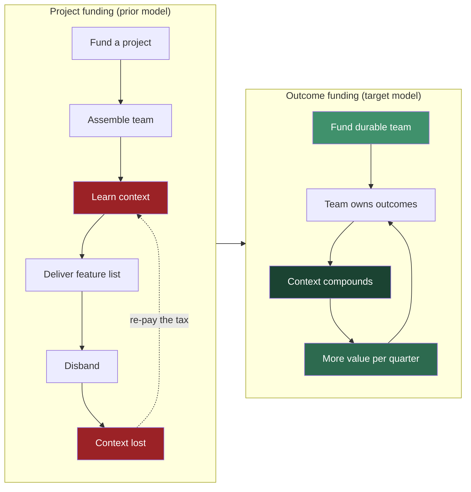
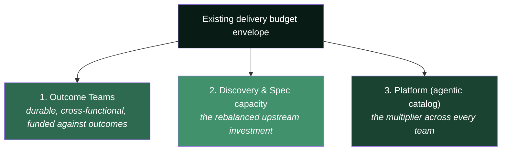
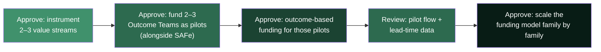

# Funding & Operating Budget Model

> **How to reshape the budget conversation — from funding projects to funding outcomes.**

Leadership framed this as a budget exercise. This document turns that framing on its head: the operating-model change *is* the budget change. It gives you the funding model, the reframes to use in the room, and the numbers that make the case.

---

## Table of Contents

- [The Central Argument](#the-central-argument)
- [From Project Funding to Outcome Funding](#from-project-funding-to-outcome-funding)
- [Three Reframes for the Room](#three-reframes-for-the-room)
- [What Gets Funded](#what-gets-funded)
- [The Numbers to Bring](#the-numbers-to-bring)
- [What Leadership Actually Approves](#what-leadership-actually-approves)
- [Objection Handling](#objection-handling)

---

## The Central Argument

We compressed the build step. But build was ~20–30% of lead time, so speeding it up while keeping the surrounding process relocates the bottleneck upstream to requirements and decisions. The budget implication:

> Audi is not being asked to fund "a new working model." It is being asked to **stop paying for a delivery system whose bottleneck is now in the wrong place** — and to move that spend to where value is actually constrained.

The money question is therefore not *"how much do we cut?"* It is *"where do we move capacity so the speed we already paid for actually reaches customers?"*

---

## From Project Funding to Outcome Funding

The **prior model** (Cagan / SVPG): the CFO funds and staffs a *project*; a team is assembled, delivers a feature list, and disbands. In an AI-fast world this is the **most expensive possible model**, because it re-pays the "form a team, learn the context" tax every time — and **context is now the scarce, most valuable asset**.

**The shift in one table:**

| Dimension | Project funding (from) | Outcome funding (to) |
|---|---|---|
| Unit of funding | A project with a fixed scope | A durable team against outcomes |
| Time horizon | Project start → end | Rolling; team persists |
| Success measure | Project delivered on time/budget | Outcome moved (metric change) per quarter |
| Context | Rebuilt each project (waste) | Compounds in a stable team (asset) |
| Scope control | Fixed scope, variable everything | Fixed team, variable scope pulled to outcomes |
| CFO's lever | Approve/kill projects | Fund/defund outcomes; adjust team count |

---

## Three Reframes for the Room

**1. From cost-cutting to capacity reallocation.**
Framing AI savings as headcount reduction caps the upside at *cost savings*. Reframe as **capacity liberated for higher-value work** — more products updated more often, faster time-to-market, and the backlog of long-deferred modernization finally addressed. McKinsey's guidance is explicit: plan for skill shifts, apply freed talent to new business expansion. The story becomes **growth and optionality**, not savings.

**2. From velocity-of-code to lead-time-of-value.**
Today you can prove "X% faster development." A CFO discounts that if it doesn't hit the P&L. Change the headline to **end-to-end lead time (idea → in customer hands)** and **flow efficiency** (% of lead time that is active work vs. waiting). That number exposes the requirements/process bottleneck in *their* language and justifies moving budget upstream.

**3. From more spend to same spend, moved.**
This is not primarily a request for new money. It is a request to **rebalance the existing envelope** — less into re-forming project teams and big-batch planning overhead, more into durable teams, discovery/spec capacity, and the platform (agentic catalog) that multiplies every team.

> **Jevons paradox:** cheaper development *increases* total demand for development. Freed capacity does not sit idle or get cut — it is consumed by more product work. This is why the model is a growth lever, not a downsizing plan.

---

## What Gets Funded

Three funding lines replace the project portfolio:

1. **Outcome Teams** — funded as durable capacity tied to business outcomes, not project scopes.
2. **Discovery & specification capacity** — the deliberate upstream rebalance that keeps teams from starving. This is the line item that is *new emphasis*, paid for by reduced project-churn and planning overhead.
3. **The Platform / agentic catalog** — funded as an internal product. Highest leverage: every improvement compounds across all teams at once.

---

## The Numbers to Bring

Do not walk in with "we're faster." Walk in with flow economics:

| Metric | Why the CFO cares | Likely finding today |
|---|---|---|
| **Flow efficiency** (active ÷ total lead time) | Shows how much paid capacity is spent *waiting* | Often 15–25% — i.e. 75%+ is waste |
| **Lead time (idea → production)** | The real speed-to-value number | Dominated by upstream, not build |
| **Requirement-starved time** | Quantifies the relocated bottleneck in € | Rising as build speeds up |
| **Cost of re-forming teams** | The context tax of project funding | Recurring, invisible today |
| **Discovery-to-delivery ratio** | Proves the rebalance is real | Skewed to delivery today |
| **DORA four keys** | Speed didn't cost stability | Baseline for the "safe" argument |

The killer slide: **flow efficiency**. If 75% of lead time is waiting, the message writes itself — *"we are paying for capacity that spends most of its time blocked upstream; the fix is to move spend to where the block is, not to buy more build speed we can't use."*

---

## What Leadership Actually Approves

Keep the ask small and evidence-led — a pilot, not a reorg:

The pitch: *"You asked for a budget model. Here is an operating model that makes the budget model make sense — fund a pilot, and we'll bring you the flow-economics data that proves where the money should move."*

---

## Objection Handling

| Objection | Response |
|---|---|
| *"This is just more spend."* | It is the same envelope, rebalanced. We spend less re-forming project teams and running big-batch planning, more on durable teams and the platform. |
| *"AI should let us cut headcount."* | Cutting caps the return at cost savings and starves the new bottleneck. Reallocating captures growth. Jevons: cheaper build increases demand. |
| *"How do we control scope without projects?"* | Fix the team, vary the scope. Outcomes and WIP limits control spend; the ready buffer prevents waste. |
| *"SAFe/PI planning is how we budget."* | Keep it for now. Pilot outcome-funding alongside it and compare the flow data before changing the whole org. |
| *"Prove the ROI first."* | That is exactly what the instrument-then-pilot sequence produces — real flow-efficiency and lead-time numbers on your own streams. |

---

*See also: [The Operating Model](future-delivery-operating-model.md) · [Team Shape & Roles](team-shape-and-roles.md) · [PO Spec Template](po-spec-template.md).*
