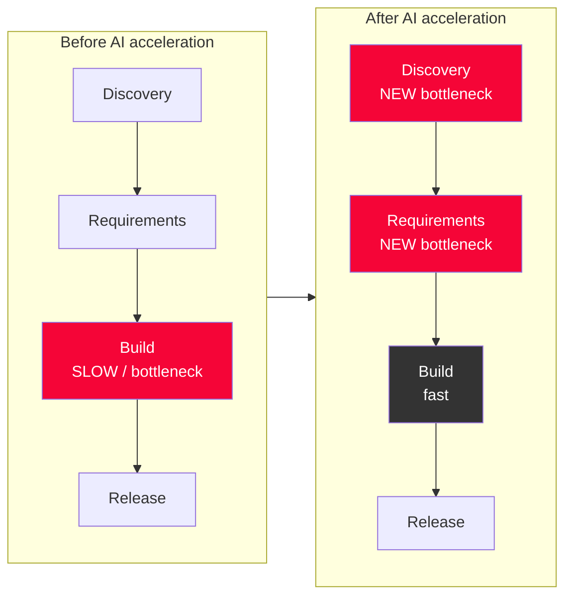
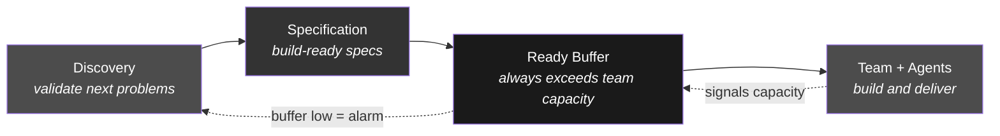
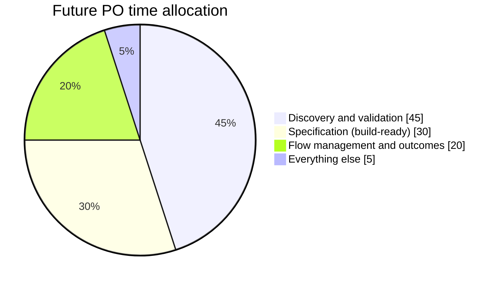
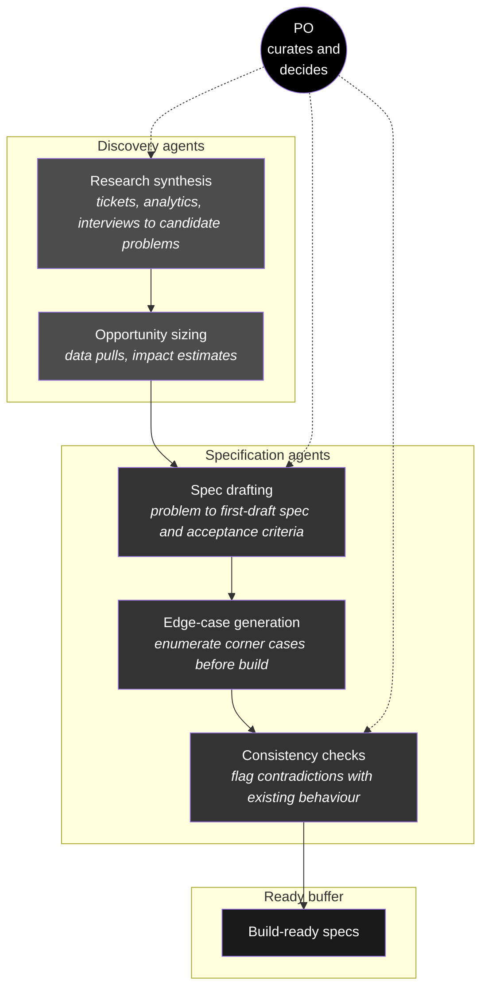
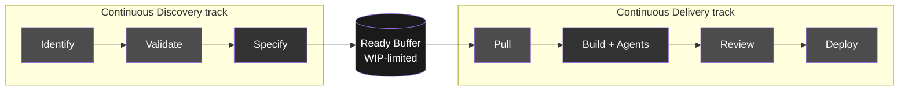
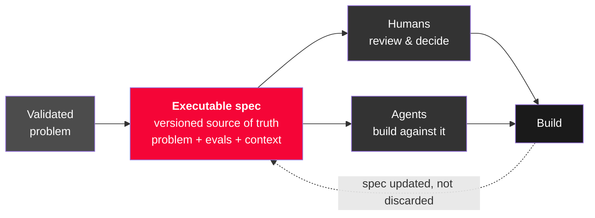
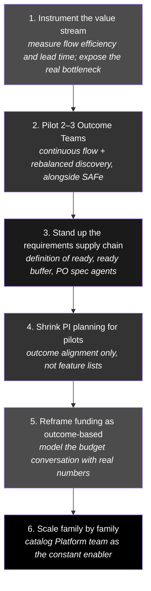

# The Future Delivery Operating Model

> **How product and delivery teams reshape around AI-accelerated development — starting with the Product Owner.**

This document describes the target operating model for Audi / Audi RED as development velocity increases through the agentic catalog. It defines what changes for teams, focuses concretely on the Product Owner (PO) role, and explains how POs use agents and AI so that developers are never starved for requirements.

---

## Table of Contents

- [The Core Reframe](#the-core-reframe)
- [The Optimal Future State](#the-optimal-future-state)
- [The Requirements Supply Chain](#the-requirements-supply-chain)
- [What Changes for the Product Owner](#what-changes-for-the-product-owner)
- [How the PO Uses Agents and AI](#how-the-po-uses-agents-and-ai)
- [Do We Still Work in Agile?](#do-we-still-work-in-agile)
- [Spec-Driven Development: The Formal Backbone](#spec-driven-development-the-formal-backbone)
- [Jevons Paradox: Freed Capacity Means More Product](#jevons-paradox-freed-capacity-means-more-product)
- [Working Back: The Transition Path](#working-back-the-transition-path)
- [Metrics That Prove It Works](#metrics-that-prove-it-works)

---

## The Core Reframe

We have compressed the **build** step. But coding was never the constraint — it is roughly 20–30% of end-to-end lead time. The other 70% is discovery, requirements, alignment, approvals, and waiting.

When build speeds up 2–3x and the surrounding process stays the same, throughput does **not** increase 2–3x. The bottleneck simply **relocates upstream** — from engineering to product definition and decision latency. Developers (and their agents) now idle against requirement starvation.

> The organisation is not being asked to fund "a new working model." It is being asked to stop paying for a delivery system whose bottleneck is now in the wrong place.

---

## The Optimal Future State

In the future state, a Product Owner is **no longer a backlog custodian**. They become the **owner of a continuous supply of validated, build-ready work**. Success is measured by one thing:

> **The team is never waiting on a decision or a spec.**

Think of it as a factory whose line speed just tripled. The line (developers + agents) is no longer the constraint. The constraint is whether raw material — well-specified, validated problems — arrives fast enough to keep the line running. The PO owns that upstream supply chain.

### The three future responsibilities of a PO

| #   | Responsibility                                 | What it means                                                                                                                                                                       |
| --- | ---------------------------------------------- | ----------------------------------------------------------------------------------------------------------------------------------------------------------------------------------- |
| 1   | **Maintain a "ready buffer"**                  | Always keep more validated, build-ready work than the team can consume next cycle. If developers stall waiting for clarity, that is a PO failure — the equivalent of a line-stop.   |
| 2   | **Own the specification, not just the story**  | Produce **executable-quality specs** — clear problem, acceptance criteria, edge cases, data, constraints — that both a human _and an agent_ can act on without a follow-up meeting. |
| 3   | **Run continuous discovery ahead of the team** | Always work one horizon ahead, validating the _next_ problems while the team builds the current ones. Discovery is a permanent parallel track, not a phase.                         |

---

## The Requirements Supply Chain

Starvation happens when the rate of producing build-ready work is lower than the rate of consuming it. AI massively raised the consumption rate, so the PO runs an explicit pipeline with a buffer, managed like inventory.

**Rules that keep the pipeline healthy:**

1. **A "definition of ready" the team can pull without questions.** Nothing enters the buffer unless specified to executable quality. This contract stops mid-build stalls. See [`po-spec-template.md`](po-spec-template.md).
2. **A minimum buffer threshold with an alarm.** When ready work drops below ~1.5x weekly throughput, the PO drops other work and refills — exactly like a low-stock alert.
3. **Continuous replenishment, not batch grooming.** The buffer is topped up continuously because it drains continuously. No "we'll refill at PI planning."
4. **Discovery always one horizon ahead of delivery.** Specs are never written under starvation pressure (which produces bad specs and _more_ mid-build questions — a death spiral).

---

## What Changes for the Product Owner

### Day-to-day: old vs. new

| Old day-to-day                                | New day-to-day                                               |
| --------------------------------------------- | ------------------------------------------------------------ |
| Grooming a backlog of tickets                 | Curating and replenishing a **ready buffer**                 |
| Writing thin stories, clarifying in-sprint    | Writing **complete, executable specs** up front              |
| Discovery in occasional workshops             | **Continuous discovery**, a permanent daily activity         |
| Waiting for sprint boundaries to reprioritize | **Reprioritizing continuously** as work flows                |
| Answering dev questions reactively mid-build  | Pre-empting questions by specifying edge cases before pickup |
| Measuring output (stories done)               | Measuring **flow** (is the team ever blocked or starved?)    |

### Where the PO's week goes

- **~45%** discovery & validation — user conversations, data, stakeholder alignment on the _next_ problems.
- **~30%** specification — turning validated problems into build-ready specs, increasingly with AI assistance.
- **~20%** flow management — keeping the buffer full, reprioritizing, unblocking, reviewing outcomes.

This is a heavy shift toward the **front** of the funnel, away from backlog admin and mid-sprint firefighting.

### The one-line reframe

> A Product Owner used to be judged on the backlog they managed. In the future they are judged on whether the team ever had to wait — for a decision, a spec, or a validated problem. Their job is to guarantee the answer is always "no."

---

## How the PO Uses Agents and AI

Our change focus has been on **delivery**. The model only balances when the PO gets the **same AI multiplier** developers already have — applied to discovery and specification. This is where the agentic catalog extends _upstream_.

### Catalog agents to build for POs

| Agent                     | Job                                                                                                                                  | Prevents                          |
| ------------------------- | ------------------------------------------------------------------------------------------------------------------------------------ | --------------------------------- |
| **Discovery synthesizer** | Turn support tickets, analytics, and interview notes into candidate problems                                                         | Discovery falling behind delivery |
| **Spec drafter**          | Expand a validated problem into a first-draft spec with acceptance criteria & edge cases; PO curates rather than writes from scratch | The PO becoming the bottleneck    |
| **Edge-case generator**   | Enumerate corner cases a PO would otherwise miss                                                                                     | Mid-build clarification stalls    |
| **Consistency checker**   | Flag specs that contradict existing behaviour or are underspecified before they hit the buffer                                       | Bad specs entering the buffer     |
| **Readiness linter**      | Score a spec against the definition of ready; block if incomplete                                                                    | Requirement starvation            |

> The PO shifts from **author** to **curator and decision-maker**: the agent drafts, enumerates, and checks; the PO validates, prioritises, and decides. This is the symmetry that makes the model balance — the top of the funnel widens at the same rate the bottom did.

**Design principle:** treat specs as **context artifacts** the same way the catalog treats agent context. A well-structured spec is simultaneously the human brief _and_ the agent's execution context — one artifact, two consumers.

---

## Do We Still Work in Agile?

Keep the agile **principles**; retire most of the agile **ceremonies**. Agile's machinery (sprints, story points, velocity, sprint planning) exists to ration a **slow, expensive build step**. When build is cheap and fast, the values survive but the scaffolding becomes overhead.

| Agile practice              | Why it existed                            | What happens to it                                |
| --------------------------- | ----------------------------------------- | ------------------------------------------------- |
| **Fixed-length sprints**    | Timebox to force feedback on a slow build | Fades — work flows continuously                   |
| **Story points / velocity** | Estimate an unpredictable, slow build     | Largely pointless — measures the wrong thing      |
| **Sprint planning**         | Batch-commit work for the timebox         | Replaced by continuous pull from the ready buffer |
| **Backlog grooming**        | Prepare a queue for a slow team           | Replaced by continuous replenishment              |
| **Daily standup**           | Sync around work-in-progress              | Survives, lighter — about unblocking flow         |
| **Retrospective**           | Continuous improvement                    | **Survives strongly** — a value, not a workaround |
| **Sprint review/demo**      | Batch feedback checkpoint                 | Fades — feedback & delivery are continuous        |

### Where you land: continuous flow (Kanban-like)

- **Pull, not batch** — the team pulls the next build-ready item when it has capacity.
- **WIP limits, not sprint commitments** — control flow by limiting work-in-progress.
- **Optimise lead time & flow efficiency, not velocity.**
- **Continuous discovery in parallel** — the dual-track model (Cagan), run continuously.

This is not anti-agile — Kanban _is_ part of the agile family and was always best suited to fast, continuous work. You move from the **batch dialect** (Scrum/SAFe) to the **flow dialect**.

> **The blunt version for leadership:** We are not abandoning agile — we are finishing it. Agile always aspired to continuous delivery of value; slow, expensive builds forced us to approximate it with sprints and estimates. AI removes that constraint, so we can finally run the _actual_ thing agile pointed at: continuous flow.

### The one caveat

**Do not drop the ceremonies before the flow system exists.** Sprints impose a rhythm that prevents chaos. Remove them without a working ready-buffer, WIP limits, and continuous discovery and you get anarchy, not flow. Build the flow machinery first, _then_ let the sprint scaffolding fall away. This is why the transition runs as pilots alongside SAFe, not a big-bang switch.

---

## Spec-Driven Development: The Formal Backbone

The single highest-leverage practice to adopt is **Spec-Driven Development (SDD)**. It is the formal name for what this whole model already depends on: the spec stops being a disposable ticket and becomes the **durable, version-controlled source of truth that both humans and agents build from.**

In a traditional flow, a story is a throwaway prompt for a conversation — it is discarded once the code is written, and the code becomes the only source of truth. That breaks down the moment agents do the building: an agent has no hallway to ask questions in, and next quarter's agent has no memory of this one's. SDD fixes this by making the spec the artifact that persists, is reviewed, is versioned, and is executed against.

**Why SDD is the backbone of this model:**

- **It formalises the PO's core artifact.** The [executable spec](po-spec-template.md) *is* the SDD spec — problem, acceptance criteria as evals, edge cases, data, and context in one durable document. Adopting SDD gives that artifact a name, a lifecycle, and tooling.
- **It is one artifact with two consumers.** A well-structured spec is simultaneously the human brief *and* the agent's execution context. This is the symmetry that lets a lean team and its agents work from the same source without a translation step.
- **It closes the loop with the agentic catalog.** The spec becomes the version-controlled input agents execute against, and evals become the automated quality gate on their output — connecting the requirements supply chain directly to the catalog.
- **It makes context durable.** Because the spec persists and is versioned, the context an agent needs is captured once and reused, instead of being re-gathered every time (directly attacking the fragmented-context blocker).

Tooling in this space is maturing quickly (e.g. Kiro, spec-kit, Tessl; see [Fowler / Thoughtworks on SDD](https://martinfowler.com/articles/exploring-gen-ai/sdd-3-tools.html)). The point is not the specific tool — it is treating the spec as a first-class, executable, durable asset. That is the practice that turns "the PO owns the requirements supply chain" from an aspiration into a concrete, tooled workflow.

---

## Jevons Paradox: Freed Capacity Means More Product

The most common leadership misread of AI-accelerated delivery is: *"if building is cheaper, we need fewer people."* The **Jevons paradox** says the opposite, and it is the single most important economic idea to internalise about this model.

> **Jevons paradox:** when a resource becomes cheaper to use, total consumption of it tends to *rise*, not fall. Cheaper steam-engine coal in the 1860s increased total coal demand. Cheaper software development increases total demand for software.

When the cost of building a feature drops, the number of ideas that are now worth building goes *up* — experiments that were previously too expensive to justify, smaller segments it never paid to serve, and quality improvements that never cleared the bar. Demand for product work expands to absorb the freed capacity.

**What this means for how we plan:**

- **Freed capacity flows to more product, not headcount cuts.** The organisation's constraint was never a shortage of good ideas — it was the cost of building them. Remove that cost and the backlog of worthwhile work grows.
- **It reinforces the upstream reframe.** If cheaper build means *more* things worth building, then the ability to discover, validate, and specify those things — the PO's upstream function — becomes the limiting factor on how much value the organisation can actually capture. Jevons is *why* the bottleneck moves upstream, not just *that* it does.
- **It reframes the ROI conversation.** The return on the agentic investment is not "same output, fewer people." It is "far more product throughput from the same durable teams" — provided the upstream supply chain can keep them fed.

> The blunt version for leadership: making building cheap does not shrink the work — it expands what is worth doing. The winners are the organisations that can *specify* fast enough to spend the new capacity well.

---

## Working Back: The Transition Path

Do not big-bang this. Run it as pilots alongside SAFe, then scale.

The pitch to leadership becomes: _"You asked for a budget model. Here is an operating model that makes the budget model make sense — and here is the pilot data proving it."_

---

## Metrics That Prove It Works

Shift the headline metric from _velocity of code_ to _lead time of value_.

| Metric                            | Definition                                      | What it exposes                                                |
| --------------------------------- | ----------------------------------------------- | -------------------------------------------------------------- |
| **Flow efficiency**               | Active time ÷ total lead time                   | How much of lead time is waiting (likely shockingly low today) |
| **Lead time (idea → production)** | Elapsed time from validated problem to customer | The headline number for leadership                             |
| **Buffer health**                 | Ready work ÷ weekly throughput                  | Whether the team is at risk of starvation (target ≥ 1.5x)      |
| **Requirement-starved time**      | % of team time blocked on a spec/decision       | Direct measure of the relocated bottleneck                     |
| **Discovery-to-delivery ratio**   | Discovery capacity ÷ delivery capacity          | Proves capacity was rebalanced upstream                        |
| **DORA four keys**                | Deploy freq, lead time, change-fail rate, MTTR  | Speed did not cost stability (talks to a CFO)                  |

---

_See also: [`po-spec-template.md`](po-spec-template.md) — the concrete definition of ready and executable spec template that makes this model work._
