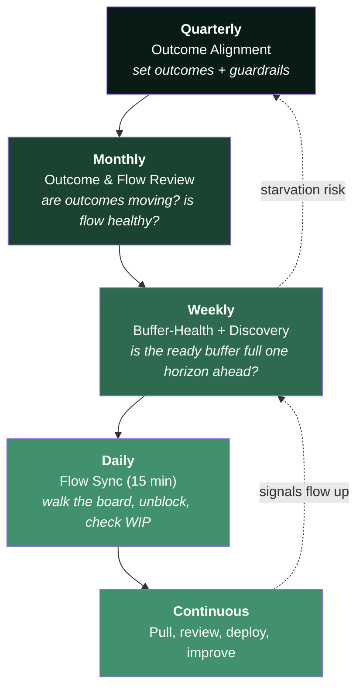
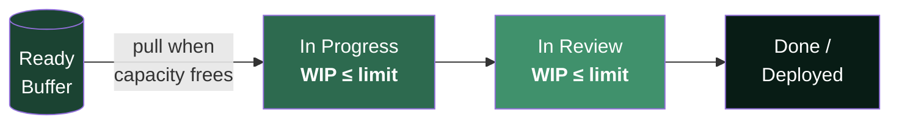

# Governance & Cadence

> **What replaces PI planning, sprints, and status meetings — the concrete rituals that keep continuous flow healthy without big-batch ceremonies.**

Continuous flow is not the absence of governance. It replaces **calendar-driven, big-batch** rituals with **signal-driven, small-batch** ones. This page defines the replacements, the cadences, and the limits that make them work.

---

## Table of Contents

- [The Principle](#the-principle)
- [What Replaces What](#what-replaces-what)
- [The Cadence Stack](#the-cadence-stack)
- [Quarterly Outcome Alignment (replaces PI planning)](#quarterly-outcome-alignment-replaces-pi-planning)
- [WIP Limits](#wip-limits)
- [The Buffer-Health Review](#the-buffer-health-review)
- [Decision Rights](#decision-rights)
- [Anti-Patterns](#anti-patterns)

---

## The Principle

> Govern the **system**, not the schedule. Set outcomes and limits, then let work pull continuously; intervene on **signals** (buffer running low, WIP creeping up, lead time rising) rather than on the calendar.

Big-batch planning exists to coordinate hand-offs and commit scope for a fixed window. In a durable, cross-functional Outcome Team with fast build, most of that coordination is designed out — so the ceremony overhead becomes pure waste.

---

## What Replaces What

| Old ritual | Problem in an AI-fast world | Replacement |
|---|---|---|
| **PI planning** (quarterly, big-batch) | Commits scope for a window; stale within weeks | **Quarterly outcome alignment** — set outcomes, not a feature list |
| **Sprint planning** | Batches work into fixed 2-week commitments | **Continuous pull** against WIP limits from the ready buffer |
| **Sprint review / demo** | Batched feedback at boundaries | **Continuous review** as work reaches done; outcome data reviewed monthly |
| **Daily standup (status)** | Status theater; who-did-what | **Flow sync** — walk the board right-to-left, unblock, check WIP |
| **Retro (per sprint)** | Tied to an arbitrary cadence | **Rolling improvement** — continuous, plus a monthly deeper review |
| **Velocity reporting** | Rewards output, gamed by agents | **Flow metrics** — lead time, flow efficiency, buffer health |

---

## The Cadence Stack

The **shorter the loop, the more it runs.** Real coordination happens continuously at the board; the calendar rituals shrink to outcome-setting and health checks.

---

## Quarterly Outcome Alignment (replaces PI planning)

A **half-day**, not multi-day, session. It sets direction and guardrails — never a locked feature list.

**Inputs**
- Business outcomes and target metric changes for the quarter
- Last quarter's outcome and flow data
- Known constraints (regulatory, platform, dependencies)

**The session produces**

| Output | What it is | What it is *not* |
|---|---|---|
| **Outcomes** | 2–4 measurable results each team owns | A backlog of committed stories |
| **Guardrails** | Constraints, non-negotiables, budget envelope | A gantt chart |
| **Bets** | Hypotheses worth pursuing, ranked | Fixed scope with deadlines |
| **Dependencies to design out** | Cross-team friction to remove | Dependencies to *coordinate* |

**The shift:** teams leave with *what result to move and how much room they have*, then discover and specify the how continuously — instead of leaving with a pre-planned feature list that decays.

---

## WIP Limits

Work-in-progress limits are the core control that makes flow work. They cap how much is in flight so items finish before new ones start.

**Rules of thumb**
- Start with **WIP ≈ team size**, then lower it until flow is smooth. Lower WIP = shorter lead time.
- **Blocked work counts against the limit** — a blocked item is not a free slot to start new work; it is a signal to swarm and unblock.
- **Finishing beats starting.** When the limit is hit, the team helps finish in-flight work rather than pulling new items.
- **Agents raise throughput, so review becomes the constraint.** Watch the review column — that is where WIP tends to pile up when agents generate volume.

---

## The Buffer-Health Review

The single ritual unique to this model. The **ready buffer** is the queue of validated, build-ready specs waiting to be pulled. It is the early-warning system for starvation.

**Weekly, the Delivery Lead + PO check:**

| Signal | Healthy | Warning | Action |
|---|---|---|---|
| **Buffer depth** | ≥ ~1 horizon of build-ready work | Draining faster than refilled | Shift PO/design capacity to spec; slow intake of new discovery |
| **Requirement-starved time** | Near zero | Rising | Root-cause the upstream blocker |
| **Discovery pipeline** | One horizon ahead | Empty ahead of the buffer | Protect discovery time; it is being crowded out |
| **Spec rejection rate** | Low, stable | Rising at pull time | Tighten the Definition of Ready; use the readiness linter agent |

> The goal is not a *big* buffer — that is just inventory waste. The goal is a buffer **deep enough that the team never waits, shallow enough that specs don't go stale.** One horizon ahead is the target.

---

## Decision Rights

Fast flow needs decisions made **inside the team**, not escalated.

| Decision | Who decides | Cadence |
|---|---|---|
| What outcome to pursue | PO, within quarterly guardrails | Continuous |
| Whether a spec is ready | PO (readiness linter assists) | At pull |
| How to build it | Engineers | Continuous |
| Whether output is good enough | Engineers + QA (evals) | At review |
| When to deploy | Team (you-build-it-you-run-it) | Continuous |
| Whether to fund/defund an outcome | Leadership | Quarterly + monthly |
| Adjusting WIP limits | Delivery Lead + team | As flow data dictates |

---

## Anti-Patterns

- **Renaming sprints "flow."** Keeping 2-week batch commitments and calling it Kanban changes nothing. Flow requires WIP limits and continuous pull.
- **Skipping WIP limits.** Without them, "continuous flow" becomes unlimited multitasking and lead time explodes.
- **A giant ready buffer.** Deep queues are inventory waste and go stale; size the buffer to one horizon, not to "as much as possible."
- **Quarterly alignment that locks scope.** If the quarterly session produces a feature list with dates, you have rebuilt PI planning under a new name.
- **Status-driven standups.** If the daily sync is people reporting what they did, it adds no flow value. Walk the board and remove blockers instead.

---

*See also: [The Operating Model](future-delivery-operating-model.md) · [Team Shape & Roles](team-shape-and-roles.md) · [Funding & Operating Budget](funding-and-operating-budget.md) · [PO Spec Template](po-spec-template.md).*
