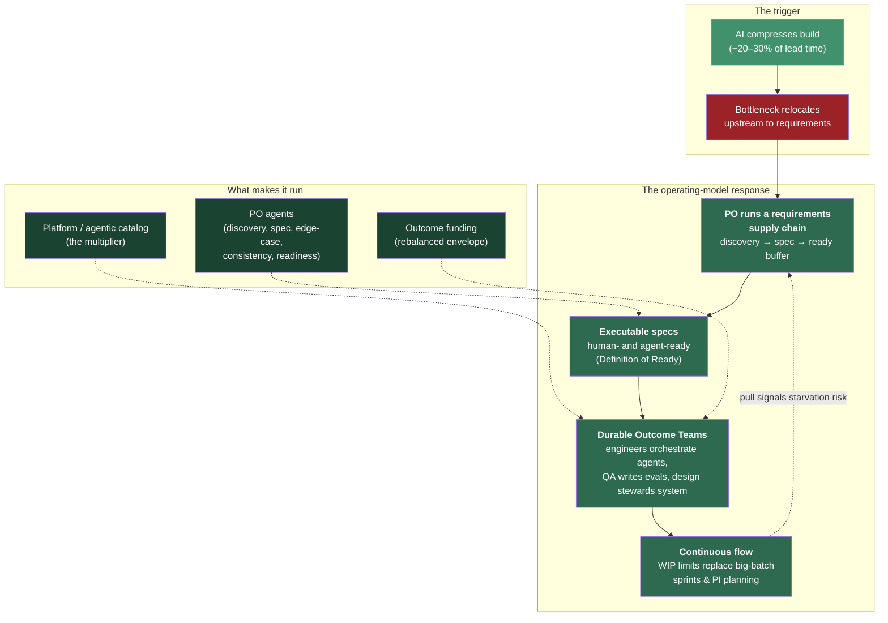
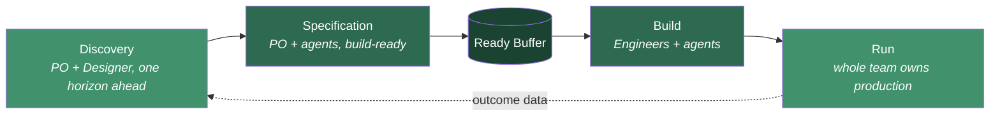

# The Model at a Glance

> **One page that ties every piece together — the reframe, the roles, the flow, the funding, and how they reinforce each other.**

---

## The whole model in one diagram

---

## How the pieces reinforce each other

| Piece | Solves | Depends on | Detailed in |
|---|---|---|---|
| **Requirements supply chain** | Team starvation as build speeds up | Executable specs + PO agents | [Operating Model](future-delivery-operating-model.md) |
| **Upstream blockers cleared** | The real waits that starve a fast team | Decisions, context, clarity owned upstream | [Upstream Blockers](upstream-blockers.md) |
| **Executable specs** | Ambiguity that stalls humans and agents | Definition of Ready | [PO Spec Template](po-spec-template.md) |
| **Durable Outcome Teams** | Context tax of re-forming project teams | Outcome funding | [Team Shape & Roles](team-shape-and-roles.md) |
| **Continuous flow** | Batch delay from sprints / PI planning | WIP limits + ready buffer | [Governance & Cadence](governance-and-cadence.md) |
| **Outcome funding** | Spend stuck where value is not constrained | Flow metrics as evidence | [Funding & Operating Budget](funding-and-operating-budget.md) |
| **Platform / agentic catalog** | Every team reinventing tooling | Funded as an internal product | [Team Shape & Roles](team-shape-and-roles.md#the-supporting-teams) |

The system is **self-reinforcing**: better specs feed the supply chain → the supply chain keeps durable teams busy → durable teams compound context → context makes agents more effective → agents make specs cheaper to produce. Break any link and the team starves or the speed is wasted.

---

## The flow of value, end to end

The center of gravity sits **upstream**: discovery and specification are the new constraint, so that is where the team's effort — and the budget — concentrate.

---

## Where to go next

- **Two-minute leadership version** → [Executive Summary](executive-summary.md)
- **The full argument** → [The Operating Model](future-delivery-operating-model.md)
- **What actually blocks us upstream** → [Upstream Blockers](upstream-blockers.md)
- **How teams are shaped** → [Team Shape & Roles](team-shape-and-roles.md)
- **How work is governed** → [Governance & Cadence](governance-and-cadence.md)
- **How it is funded** → [Funding & Operating Budget](funding-and-operating-budget.md)
- **The keystone artifact** → [PO Spec Template](po-spec-template.md)
