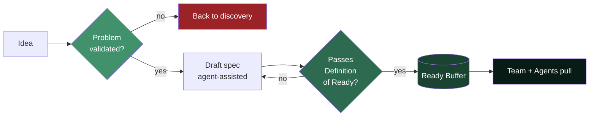

# PO Spec Template & Definition of Ready

> **The keystone artifact of the [future delivery operating model](future-delivery-operating-model.md).**

This is the contract that lets a team pull work **without asking questions**. A spec enters the _ready buffer_ only when it passes the Definition of Ready below. The template is written so **both a human developer and an AI agent** can execute it as-is — one artifact, two consumers.

Copy the [template](#the-spec-template) for each new piece of work.

---

## Table of Contents

- [Why This Exists](#why-this-exists)
- [Definition of Ready (the gate)](#definition-of-ready-the-gate)
- [The Spec Template](#the-spec-template)
- [Readiness Checklist](#readiness-checklist)
- [How Agents Help Produce This](#how-agents-help-produce-this)
- [Worked Example](#worked-example)

---

## Why This Exists

In the old world a story could be one sentence; a mid-sprint conversation filled the gaps because building was slow enough to absorb the back-and-forth. Now, **ambiguity resolved during build is the new bottleneck** — a developer or agent stalling for a clarification wipes out the speed gain.

So the spec must be complete _before_ it enters the buffer. This template is the definition of "complete."

> **Rule:** If a developer or agent has to ask the PO a question to start work, the spec was not ready. Fix the template, not the person.

---

## Definition of Ready (the gate)

A spec may enter the ready buffer **only if all are true**:

- [ ] **Problem is validated** — evidence it is worth solving (data, user signal, or explicit business decision).
- [ ] **Outcome is measurable** — success is stated as an observable change, not an output.
- [ ] **Acceptance criteria are testable** — each is a pass/fail statement (an eval).
- [ ] **Edge cases are enumerated** — the non-happy paths are listed, not left implicit.
- [ ] **Data & interfaces are specified** — inputs, outputs, sources, contracts named.
- [ ] **Constraints are explicit** — security, compliance, performance, brand, accessibility.
- [ ] **Out-of-scope is stated** — what this work deliberately does _not_ do.
- [ ] **No open questions remain** — the "Open Questions" section is empty.

If any box is unchecked, the item stays in **specification**, not the buffer.

---

## The Spec Template

````markdown
# Spec: <short title>

## 1. Problem & Evidence

- **Problem:** <what user/business problem, in one or two sentences>
- **Evidence it matters:** <data point, user quote, support volume, business decision>
- **Who is affected:** <user segment / persona / system>

## 2. Outcome (measurable)

- **We will know this worked when:** <observable change, e.g. "checkout drop-off
  on step 3 falls below X%">
- **Primary metric:** <metric + current baseline + target>

## 3. Acceptance Criteria (testable / evals)

- [ ] GIVEN <context> WHEN <action> THEN <observable result>
- [ ] GIVEN <context> WHEN <action> THEN <observable result>
- [ ] ...

## 4. Edge Cases & Non-Happy Paths

- <empty input / max input / concurrent action / permission denied / offline / …>
- <expected behaviour for each>

## 5. Data & Interfaces

- **Inputs:** <fields, types, sources>
- **Outputs:** <fields, destinations>
- **Contracts/APIs touched:** <names, versions>
- **State changes:** <what persists>

## 6. Constraints

- **Security & privacy:** <authn/authz, PII handling, data residency>
- **Compliance/brand/a11y:** <relevant standards>
- **Performance:** <latency/throughput targets>

## 7. Scope Boundaries

- **In scope:** <bullet list>
- **Out of scope:** <bullet list — explicit non-goals>

## 8. Context for Agents

- **Relevant catalog family / skills:** <which agents/skills apply>
- **Reference implementation / patterns:** <link to anchor example>
- **Design assets:** <Figma node, tokens, components>

## 9. Open Questions

- <MUST be empty before entering the ready buffer>
````

---

## Readiness Checklist

A one-glance view of how a spec flows from idea to pullable work:



---

## How Agents Help Produce This

The PO does not write every section from scratch. The [PO agents](future-delivery-operating-model.md#how-the-po-uses-agents-and-ai) draft and check; the PO curates and decides.

| Section | Agent assist | PO does |
| --- | --- | --- |
| 1. Problem & Evidence | Discovery synthesizer pulls signals from tickets/analytics | Validates the problem is real & worth it |
| 2. Outcome | Suggests metrics + baselines from data | Chooses the target and owns the bet |
| 3. Acceptance criteria | Spec drafter generates GIVEN/WHEN/THEN | Confirms they match intent |
| 4. Edge cases | Edge-case generator enumerates corner cases | Decides expected behaviour |
| 5. Data & interfaces | Consistency checker maps existing contracts | Confirms & names sources |
| 6–7. Constraints/scope | Consistency checker flags conflicts | Sets the boundaries |
| — | Readiness linter scores against Definition of Ready | Approves entry to the buffer |

> **Design principle:** the spec _is_ the agent's execution context. Section 8 ("Context for Agents") links the spec directly to the relevant catalog family, skills, and reference patterns — so the same artifact that briefs a human also grounds the agent.

---

## Worked Example

````markdown
# Spec: Guest checkout — remember email on retry

## 1. Problem & Evidence

- Problem: Guests who mistype their email must re-enter the whole form after the
  validation error, and many abandon.
- Evidence it matters: 8.1% of guest checkouts hit the email-validation error;
  62% of those abandon within 30s (analytics, last 30 days).
- Who is affected: Guest (non-logged-in) checkout users.

## 2. Outcome (measurable)

- We will know this worked when: abandonment after an email-validation error drops.
- Primary metric: post-error abandonment rate — baseline 62%, target < 40%.

## 3. Acceptance Criteria

- [ ] GIVEN a guest submitted the form WHEN email validation fails THEN all other
      fields retain their entered values.
- [ ] GIVEN a corrected email WHEN the guest resubmits THEN checkout proceeds.
- [ ] GIVEN the page is reloaded THEN previously entered values are NOT retained.

## 4. Edge Cases & Non-Happy Paths

- Empty email → inline error, other fields retained.
- Multiple consecutive failures → values retained each time, no lockout.
- Autofill values → treated same as typed values.

## 5. Data & Interfaces

- Inputs: checkout form fields (client-side only).
- Outputs: none new; existing submit contract unchanged.
- State changes: none persisted server-side; values held in client state only.

## 6. Constraints

- Security & privacy: email held client-side only; never logged; cleared on reload.
- a11y: error announced via aria-live; focus moves to the invalid field.
- Performance: no added network round-trips.

## 7. Scope Boundaries

- In scope: field retention on validation error for guest checkout.
- Out of scope: saving data across sessions; logged-in checkout; address validation.

## 8. Context for Agents

- Relevant catalog family / skills: <checkout-flow family>, form-validation skill.
- Reference implementation: <link to existing form component pattern>.
- Design assets: <Figma node for checkout error state>.

## 9. Open Questions

- (none)
````

---

_Back to the model: [`future-delivery-operating-model.md`](future-delivery-operating-model.md)._
