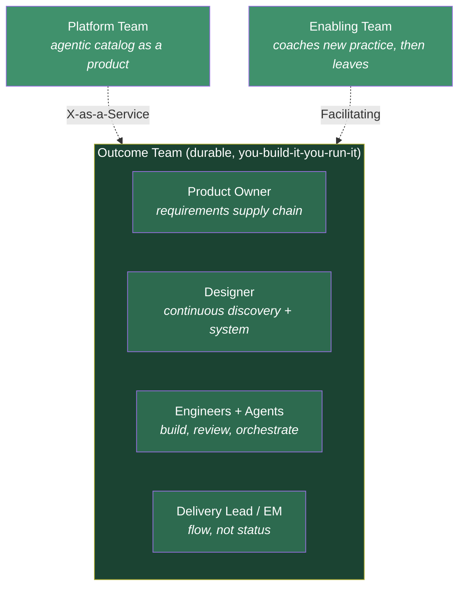
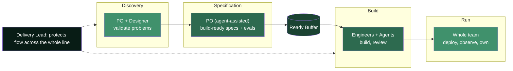

# Team Shape & Roles in the Flow Model

> **What changes for every role on the team — not just the Product Owner — when build is fast and work flows continuously.**

The [PO deep-dive](future-delivery-operating-model.md#what-changes-for-the-product-owner) covered the upstream half. This document defines the **whole team**: how an Outcome Team is composed, and what changes day-to-day for engineers, designers, the engineering/delivery lead, and QA.

---

## Table of Contents

- [The Outcome Team](#the-outcome-team)
- [Role-by-Role Changes](#role-by-role-changes)
- [Who Does What Across the Flow](#who-does-what-across-the-flow)
- [The Supporting Teams](#the-supporting-teams)
- [What This Means for Team Size](#what-this-means-for-team-size)
- [Anti-Patterns to Avoid](#anti-patterns-to-avoid)

---

## The Outcome Team

The unit of delivery becomes a **durable, cross-functional Outcome Team** — stream-aligned in [Team Topologies](https://teamtopologies.com/key-concepts) terms. It owns a slice of the domain **end-to-end**: discovery → build → run. No hand-off to a separate delivery or ops team.

**Three principles hold the shape together:**

1. **Durable, not project-assembled.** The team stays together across outcomes. Context — the scarce asset in an AI-fast world — accrues in a stable team and is destroyed by re-forming one per project.
2. **Cross-functional and end-to-end.** Everything needed to take a validated problem to a running feature lives inside the team. Dependencies are designed *out*, not coordinated.
3. **Bounded cognitive load.** The team owns a domain slice small enough to hold in its head. The Platform team absorbs complexity so the Outcome Team stays fast.

---

## Role-by-Role Changes

### Product Owner
Covered in depth in the [operating model](future-delivery-operating-model.md#what-changes-for-the-product-owner). In one line: **from backlog custodian to owner of the requirements supply chain** — guaranteeing the team never waits on a spec or decision. ~45% discovery, ~30% specification, ~20% flow management.

### Engineer
The biggest shift after the PO. From **author of code** to **orchestrator, reviewer, and system-owner**.

| From | To |
|---|---|
| Writing most code line-by-line | Directing agents, then reviewing/curating output |
| Story-sized tickets, sprint commitment | Pulling build-ready specs continuously (WIP-limited) |
| Quality via manual authorship | Quality via review, tests-as-specs, and evals |
| "Done" = merged | "Done" = deployed, observed, owned in production |
| Estimation & velocity | Flow: lead time, keeping WIP low, unblocking |

What becomes **more** valuable, not less: architecture, system design, reading and judging code, debugging, and knowing *what good looks like* so agent output can be trusted. (See McKinsey and Fowler — human oversight is where AI-built code succeeds or fails.)

### Designer
From **project-phase design** to **continuous discovery partner + design-system steward**.

| From | To |
|---|---|
| Designing screens ahead of a sprint | Running discovery *with* the PO, one horizon ahead |
| Handing off static specs | Maintaining a living design system agents build from |
| Reviewing at sprint boundaries | Continuous validation as work flows |

The design system becomes an **agent-consumable asset** — the same tokens/components that brief a human also ground the build agents (one artifact, two consumers, mirroring the spec principle).

### Delivery Lead / Engineering Manager
From **managing status and capacity** to **managing flow and health**.

| From | To |
|---|---|
| Running sprint ceremonies, tracking velocity | Managing WIP limits, lead time, buffer health |
| Assigning work | Removing blockers so the team pulls freely |
| Reporting "% committed complete" | Reporting flow efficiency & requirement-starved time |
| Capacity planning per PI | Protecting durable-team stability & cognitive load |

The EM becomes the guardian of the **flow system** itself — the person who notices the ready buffer running low or WIP creeping up, and acts before the team stalls.

### QA / Quality
From **a test phase** to **quality-as-specification, embedded and continuous**.

| From | To |
|---|---|
| Testing after build, in a phase | Acceptance criteria written as **evals** up front |
| Manual regression at release | Continuous automated checks; QA designs the eval suite |
| Gatekeeper at the end | Quality-coach embedded in the flow |

QA's expertise moves **upstream** into the spec (Section 3 acceptance criteria / evals) and into the automated gates that let continuous delivery stay safe.

---

## Who Does What Across the Flow

The center of gravity shifts **left**: more of the team's collective effort sits in discovery and specification, because that is now the constraint. Build and run are fast — the team's job is to keep them *fed* and *safe*.

---

## The Supporting Teams

Two team types exist *around* the Outcome Teams (Team Topologies):

| Team | Interaction | Purpose |
|---|---|---|
| **Platform Team** | X-as-a-Service | Owns the **agentic catalog as an internal product** (a Thinnest Viable Platform). Keeps Outcome Teams fast without adding dependencies. This is where your existing catalog investment lives. |
| **Enabling Team** | Facilitating | Temporarily coaches Outcome Teams into the new practice (flow, spec quality, agent use), then moves on. Drives the pilot-to-scale transition. |

> The Platform team is the constant multiplier. Every improvement to the catalog compounds across every Outcome Team simultaneously — the highest-leverage investment in the model.

---

## What This Means for Team Size

- **Teams get smaller and more senior**, not larger. AI raises the leverage of each experienced person; the constraint becomes judgment (what to build, is this output good), not typing capacity.
- **The mix shifts upstream** — relatively more discovery/product/design/spec capacity, relatively less pure build headcount, because build is no longer where time goes.
- **Freed capacity is reallocated, not cut.** Consistent with the [funding model](funding-and-operating-budget.md): cheaper build increases demand (Jevons), so capacity moves to more products and long-deferred work — the growth story, not the layoff story.

---

## Anti-Patterns to Avoid

- **The AI-assisted feature factory.** Speeding up build while keeping hand-offs, project teams, and big-batch planning — you just hit the upstream wall faster.
- **Reforming teams per project.** Destroys the accumulated context that makes an AI-fast team effective.
- **The PO as sole bottleneck.** If the PO must hand-write every spec, the team starves. The [PO agents](future-delivery-operating-model.md#how-the-po-uses-agents-and-ai) exist precisely to prevent this.
- **Measuring engineers on output.** Lines, story points, or commit counts push exactly the wrong behaviour when agents generate the volume. Measure flow and outcomes.
- **A bloated platform.** The catalog must stay a *thin* enabling product, not a mandatory gate that slows teams down.

---

*See also: [The Operating Model](future-delivery-operating-model.md) · [Funding & Operating Budget](funding-and-operating-budget.md) · [PO Spec Template](po-spec-template.md).*
