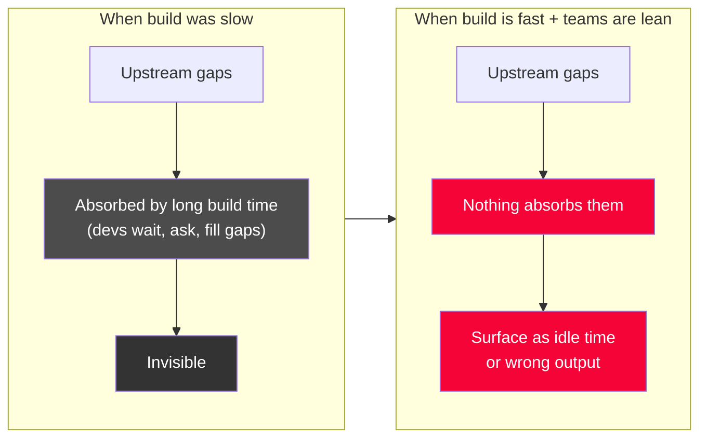
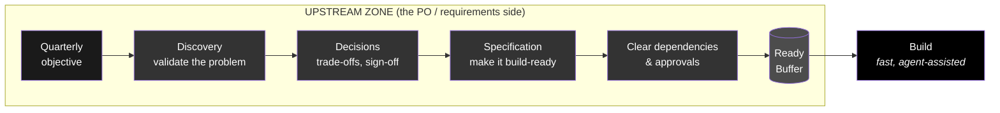
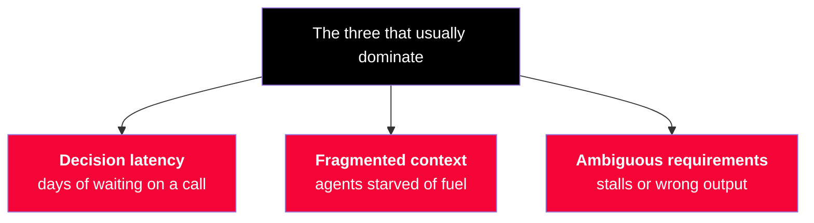
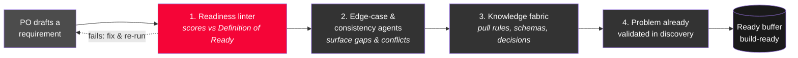

# Upstream Blockers — Where the Work Actually Gets Stuck

> **The heart of the model. Build is no longer the constraint. This page maps what actually blocks a standing team upstream — on the PO and requirements side — and how to clear each blocker.**

Our teams are already durable and topic-aligned. They are not assembled and disbanded per project; they own a couple of topics and receive **new objectives each quarter**. So the interesting question is not *"how do we structure teams?"* — that is largely solved. It is:

> **When a standing team can build in hours instead of weeks, what is it actually waiting on?**

The answer is almost never "more engineering capacity." It is a set of **upstream blockers** that used to be invisible — because slow build time hid them. This page names them.

---

## Table of Contents

- [Why Upstream Became the Constraint](#why-upstream-became-the-constraint)
- [The Upstream Zone](#the-upstream-zone)
- [The Blocker Catalog](#the-blocker-catalog)
  - [1. Decision Latency](#1-decision-latency)
  - [2. Ambiguous, Non-Executable Requirements](#2-ambiguous-non-executable-requirements)
  - [3. Unvalidated Problems](#3-unvalidated-problems)
  - [4. Fragmented Context](#4-fragmented-context)
  - [5. Cross-Team Dependencies & Approvals](#5-cross-team-dependencies-approvals)
  - [6. Objective Churn & Unclear Prioritization](#6-objective-churn-unclear-prioritization)
  - [7. The PO as a Single Point of Contention](#7-the-po-as-a-single-point-of-contention)
- [Which Blockers Dominate](#which-blockers-dominate)
- [How to See Them](#how-to-see-them)
- [How the PO Self-Validates Requirements](#how-the-po-self-validates-requirements)
- [What the PO's Job Becomes](#what-the-pos-job-becomes)

---

## Why Upstream Became the Constraint

When build was slow, upstream sloppiness was **absorbed** by the development step. A developer waiting days to build had ample time to chase a missing decision, fill an ambiguous requirement with judgment, or ask the domain expert a question in the hallway. The wait *hid* the blocker.

Two things changed at once:

- **Build compressed.** What took weeks now takes hours. The absorbing buffer is gone.
- **Teams are smaller and more agentic.** There is less slack to soak up ambiguity, and an agent — unlike a senior developer — will not quietly supply the missing context. It stalls, or it guesses wrong and produces confident, plausible, incorrect output.

> The blockers were always there. Fast, lean, agentic delivery did not create them — it **removed the thing that was hiding them.** Illustrating the new model means making these upstream blockers visible and owning them deliberately.

---

## The Upstream Zone

Everything to the *left* of the team's build step is the upstream zone. It is where a standing team's time actually goes when it is not shipping.

A blocker at **any** stage in this zone starves the fast build step downstream. The PO's real job is to keep this whole zone flowing — the [requirements supply chain](future-delivery-operating-model.md).

---

## The Blocker Catalog

Seven blockers, in roughly the order they bite. For each: the **symptom**, **why it bites harder now**, and **how to clear it**.

### 1. Decision Latency

**Symptom.** The spec is ready except for one decision — a trade-off, a prioritization call, a sign-off — and it sits waiting on a stakeholder, a committee, or a meeting that is three days out.

**Why it bites harder now.** Build dropped from weeks to hours, but a decision still takes days. Decision latency was a rounding error against slow build; now it is often the **single largest component of lead time**. A lean team cannot route around it.

**How to clear it.**
- Push **decision rights into the team** wherever possible (see [Governance & Cadence](governance-and-cadence.md#decision-rights)). The fastest decision is the one that never leaves the team.
- For decisions that must escalate, make them **asynchronous and pre-framed**: the PO brings the options, the recommendation, and the reversibility, so the approver says yes/no in minutes, not schedules a workshop.
- Track **decision cycle time** as a first-class metric. What you do not measure, you cannot compress.

### 2. Ambiguous, Non-Executable Requirements

**Symptom.** A requirement is "clear enough" for a human who will ask questions, but not complete enough to act on without a follow-up conversation. The build step stalls on clarification, or an agent guesses and produces the wrong thing.

**Why it bites harder now.** Human developers silently repaired ambiguous requirements using tacit knowledge. Agents do not. Ambiguity that was a minor tax is now a **hard stop or a confident wrong answer.**

**How to clear it.**
- Adopt the [Definition of Ready + executable spec template](po-spec-template.md): every item carries testable acceptance criteria (evals), edge cases, data/interfaces, and context — enough that a human *or an agent* can act with no follow-up.
- Treat a spec that triggers a clarifying question at build time as a **defect in the spec**, and feed it back into the Definition of Ready.

### 3. Unvalidated Problems

**Symptom.** The team ships quickly and correctly — but the objective does not move, because the problem was assumed, not validated. Fast delivery of the wrong thing.

**Why it bites harder now.** Speed amplifies waste. When building the wrong thing took a quarter, discovery had time to catch up. When it takes a day, you can now build the wrong thing *many times per quarter*. Cheap build makes **discovery quality the dominant lever on value.**

**How to clear it.**
- Run **continuous discovery one horizon ahead** of delivery, so validated problems — not assumed ones — enter the spec stage.
- Gate the ready buffer on evidence: an item is not ready until the problem it solves is validated, not merely requested.

### 4. Fragmented Context

**Symptom.** The domain rules, data schemas, prior decisions, constraints, and design system an agent (or a new team member) needs are scattered across people's heads, wikis, chat threads, and old tickets. Producing a build-ready spec means a scavenger hunt.

**Why it bites harder now.** In an agentic model, **context is the fuel.** An agent is only as good as the context it is handed. Knowledge trapped in a senior engineer's head was fine when that engineer wrote the code; it is a blocker when a lean team briefs agents. This is the highest-leverage thing our ecosystem investment addresses.

**How to clear it.**
- Make context a **maintained asset**, not a tribal one: a living, agent-consumable knowledge fabric (domain rules, schemas, decisions, design system) that specs and agents draw from.
- Every spec's "context for agents" section links to this fabric rather than re-deriving it — so context compounds instead of being re-gathered each time.

### 5. Cross-Team Dependencies & Approvals

**Symptom.** The team is ready to build but is waiting on another team's API, a platform capability, or an approval — security, legal, brand, data protection. Build speed buys nothing while a two-week review runs.

**Why it bites harder now.** When your own build was the bottleneck, a parallel two-week security review was free. Now it is *the* bottleneck. External waits dominate once internal build is instant.

**How to clear it.**
- **Design dependencies out.** A durable, cross-functional team should own end-to-end as much as possible; treat every recurring cross-team wait as friction to remove, not to coordinate.
- Move approvals **upstream and continuous** — engage security/legal/brand at spec time with clear criteria (ideally as evals), so review is a fast check against known rules, not a late gate.

### 6. Objective Churn & Unclear Prioritization

**Symptom.** Quarterly objectives shift mid-quarter, or the "what's most important next" answer is fuzzy. The PO cannot keep the ready buffer full because the target keeps moving.

**Why it bites harder now.** A lean, fast team drains a ready buffer quickly. If prioritization is unclear or objectives thrash, the buffer empties and the team idles — the fast engine runs out of fuel. Slow teams never noticed because they were always still building the last thing.

**How to clear it.**
- Set objectives at the [quarterly outcome alignment](governance-and-cadence.md#quarterly-outcome-alignment-replaces-pi-planning) as **stable outcomes with guardrails**, not a churning feature list — direction that holds for the quarter even as the *how* flexes.
- Maintain a **shallow but always-full ready buffer** (one horizon deep) so short-term reprioritization pulls from ready work instead of stalling.

### 7. The PO as a Single Point of Contention

**Symptom.** Every clarification, decision, and priority question routes through one PO covering multiple topics. The PO becomes the bottleneck for the entire fast team.

**Why it bites harder now.** A smaller team has less slack to absorb PO unavailability, and a faster team generates clarification needs faster. One human owning discovery + specification + decisions + stakeholder management for several topics cannot keep pace unaided.

**How to clear it.**
- **Give the PO leverage, not just more hours.** The [PO agents](future-delivery-operating-model.md#how-the-po-uses-agents-and-ai) — discovery synthesizer, spec drafter, edge-case generator, consistency checker, readiness linter — exist precisely so one PO can keep a fast team fed.
- Distribute what does not need the PO: push decision rights into the team, and make context self-serve via the knowledge fabric so people stop routing questions through the PO.

---

## Which Blockers Dominate

Not all seven are equal. In a fast, lean, agentic setup, the top three almost always dominate lead time:

Start here. The other four matter, but decisions, context, and clarity are where the biggest, fastest wins are — and they are entirely upstream of the engineering the AI already accelerated.

---

## How to See Them

You cannot manage what you cannot see. Each blocker leaves a measurable trace:

| Blocker | The signal that exposes it |
|---|---|
| Decision latency | **Decision cycle time**; time items spend in a "waiting on decision" state |
| Ambiguous requirements | **Clarification requests at build time**; spec rejection/rework rate |
| Unvalidated problems | **Discovery-to-delivery ratio**; shipped items that did not move the objective |
| Fragmented context | Time-to-produce-a-spec; repeated re-gathering of the same context |
| Dependencies & approvals | Time items spend **blocked on external parties** |
| Objective churn | **Buffer depth over time**; mid-quarter reprioritization count |
| PO contention | **Requirement-starved time**; queue of questions waiting on the PO |

The keystone metric across all of them is **requirement-starved time** — how long the fast team sits without validated, build-ready work. If that number is anything but near-zero, one or more of these blockers is active.

---

## How the PO Self-Validates Requirements

Blockers **#2 (ambiguous requirements)** and **#7 (PO as a single point of contention)** share one root cause: the PO's only way to confirm a requirement is *right* is to ask a developer. Every "is this correct?" becomes a human round-trip that stalls a fast team and turns the PO into a relay. The fix is to replace that round-trip with **self-serve validation loops** — so *right* is confirmed by tooling and evidence, not by an engineer's availability.

Five loops let the PO answer "is this right?" without asking development:

1. **Make "right" a testable contract.** A requirement isn't done when it *reads* well — it's done when it carries **executable acceptance criteria (evals)** a human *or an agent* can check automatically. Correctness becomes something you *run*, not something you *ask*. Any clarifying question raised at build time is treated as a **defect in the spec** and folded back into the Definition of Ready, so it is never asked twice.
2. **Lint readiness before a developer ever sees it.** The **readiness linter** scores each draft against the Definition of Ready and blocks incomplete specs. This is the highest-leverage loop: the *machine*, not an engineer, tells the PO the spec is thin.
3. **Pressure-test with agents first.** The **edge-case generator** enumerates corner cases the PO would otherwise discover only through a dev question; the **consistency checker** flags contradictions with existing behaviour. The PO validates against agents and escalates only the genuinely novel calls.
4. **Make context self-serve.** Most "is this right?" questions are really "what's the existing rule / schema / prior decision here?" A maintained, agent-consumable **knowledge fabric** lets the PO and agents pull that answer directly instead of routing it through the one person who remembers.
5. **Validate the problem upstream.** Continuous discovery one horizon ahead — plus cheap *build-to-learn* throwaway prototypes — means a problem is validated *before* it becomes a spec, removing the largest class of "is this right?" (the ones where nobody actually knows yet).

Where a judgement call genuinely remains, the fastest answer is the one that never leaves the team: pre-agreed **decision rights** plus async, pre-framed escalations (see [Governance & Cadence](governance-and-cadence.md#decision-rights)) mean the PO isn't blocked waiting on a developer's opinion for reversible calls.

> **In one line:** the PO stops asking "is this right?" by making *right* mean *"passes the readiness linter, carries evals, draws on curated context, and solves a validated problem"* — so correctness is verified by tooling and evidence, not by a developer's time.

---

## What the PO's Job Becomes

Every blocker above lands on the PO / requirements function. So the PO's role is not "write more tickets faster." It is to **own and clear the upstream zone** so a standing, fast team is never starved:

- Compress **decisions** (get rights into the team, pre-frame escalations).
- Guarantee **clarity** (executable specs, Definition of Ready).
- Ensure **validity** (continuous discovery ahead of delivery).
- Curate **context** (a maintained knowledge fabric agents can consume).
- Remove **dependencies** (design them out; approvals upstream).
- Stabilize **priorities** (outcome guardrails, a shallow always-full buffer).
- Take **leverage** from agents so one PO can keep pace.

That is the new model in one sentence: **the constraint moved upstream, so the upstream function — the PO and requirements side — becomes the pacing function of the whole team.**

---

*See also: [The Operating Model](future-delivery-operating-model.md) · [Governance & Cadence](governance-and-cadence.md) · [Team Shape & Roles](team-shape-and-roles.md) · [PO Spec Template](po-spec-template.md).*
